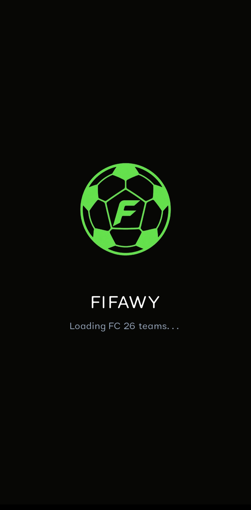
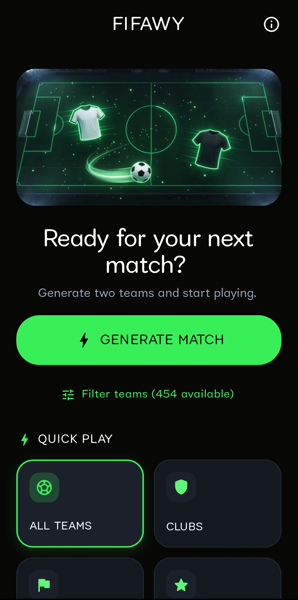
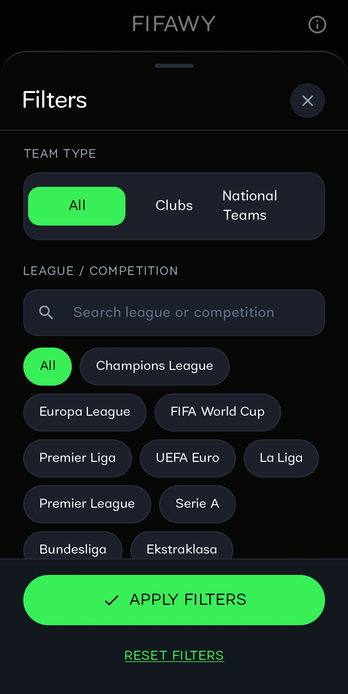
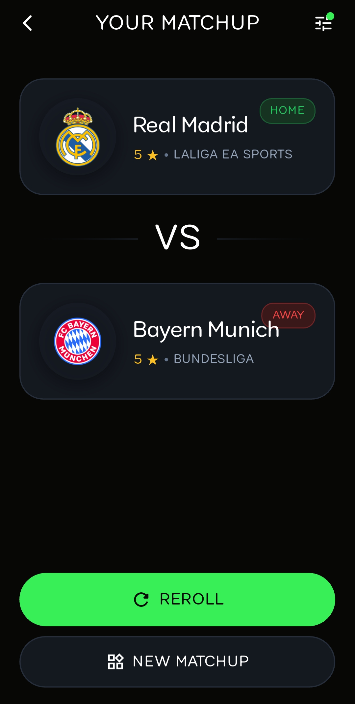
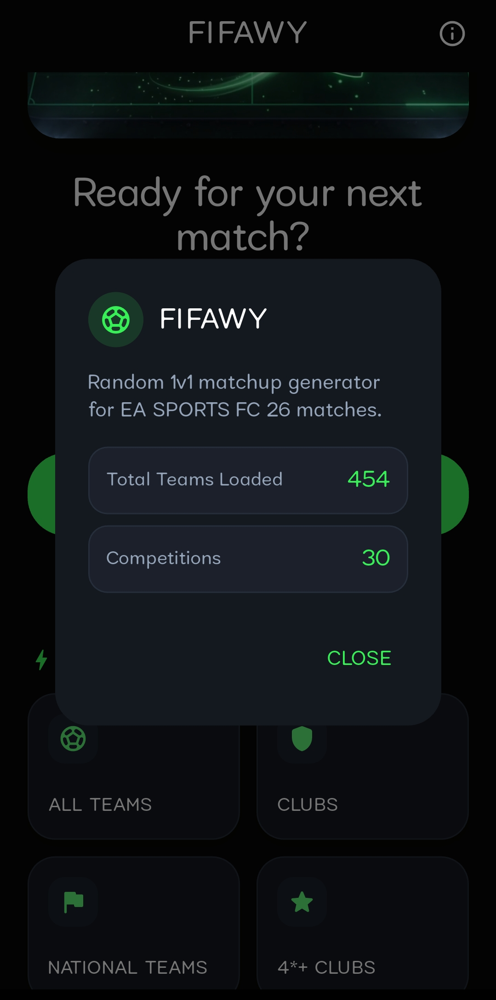

# **Fifawy**

**Fifawy** is a sleek, modern Flutter application built for EA SPORTS FC 26 players to quickly generate fair, customizable, and random 1v1 matchups for competitive kick-off and couch gaming sessions.

<div align="center">
  <br/>
  <a href="https://drive.google.com/file/d/1WzEx9Q8TvtNa1mKHix9nmvT-NgVhvvXs/view?usp=sharing">
    
  </a>
  <br/><br/>
</div>

---

## Screenshots

<div align="center">
  
  
  
</div>

<br/>

<div align="center">
  
  
</div>

---

## Features & How It Works

- **Instant 1v1 Matchup Generation**: With a single tap, generate a balanced home vs. away match without endless scrolling through team selection menus.
- **One-Tap Quick Play Presets**:
  - **All Teams**: Pick randomly from the full catalog of available teams.
  - **Clubs Only**: Limits the pool strictly to club teams.
  - **National Teams**: Generates matchups exclusively between national squads.
  - **4★+ Clubs**: Automatically filters for top-tier competitive club matchups.
- **Deep Filtering Controls**:
  - Filter by **Team Type** (Clubs, National Teams, or All).
  - Filter by **League / Competition** with integrated search and quick chips (Premier League, La Liga, Champions League, FIFA World Cup, Serie A, Bundesliga, etc.).
  - Filter by **Star Rating** (e.g. 3.5★, 4★, 4.5★, 5★).
  - Live preview badge displaying eligible teams count before applying.
- **Dynamic Matchup Screen**:
  - Displays high-resolution team logos, official club names, star ratings, league tags, and home/away badges.
  - **Reroll**: Spin again instantly with the active filter parameters.
  - **Quick Adjust**: Modify filters directly from the matchup screen.
- **App Info & Statistics**: View total loaded teams, competitions count, and dataset status.

---

## Technical Details & Team Dataset

### Curated FC 26 Dataset
The application is powered by an offline dataset (`data/teams_offline.json`) updated for EA SPORTS FC 26:
- **450+ teams** across major domestic leagues and international tournaments.
- **30+ competitions** including domestic divisions (Premier League, La Liga, Serie A, Bundesliga, etc.) and global tournaments (UEFA Champions League, UEFA Europa League, FIFA World Cup, UEFA Euro).
- **High-Resolution Crests**: Dedicated local club and nation badge assets stored in `data/logos/`.
- **Zero-Latency Offline Execution**: Team rosters, star ratings, and competition mapping are bundled locally in the app with no external network dependencies or API latency.

### Data Format
Each entry in `teams_offline.json` follows a structured schema:

```json
{
  "id": "real_madrid",
  "name": "Real Madrid",
  "type": "club",
  "country": "Spain",
  "competitions": [
    "laliga_ea_sports",
    "uefa_champions_league"
  ],
  "stars": 5.0,
  "logo": "logos/real_madrid.png"
}
```

- **`id`**: Unique normalized string identifier.
- **`name`**: Official team display name.
- **`type`**: `"club"` or `"national"`.
- **`country`**: Team nationality or country of origin.
- **`competitions`**: Array of linked league and tournament identifiers.
- **`stars`**: Official half-star precision rating (from 0.5 to 5.0).
- **`logo`**: Relative path to the local asset emblem.

---

## Getting Started

### Download APK
You can directly download and install the latest Android build:
- [Download Fifawy APK (Google Drive)](https://drive.google.com/file/d/1WzEx9Q8TvtNa1mKHix9nmvT-NgVhvvXs/view?usp=sharing)

### Prerequisites (For Development)
- Flutter SDK (3.13.0 or higher)
- Android Studio / VS Code with Flutter extension
- Connected Android device or Emulator

### Installation & Run

1. **Clone the repository:**
   ```bash
   git clone https://github.com/your-username/fifawy.git
   cd fifawy
   ```

2. **Install dependencies:**
   ```bash
   flutter pub get
   ```

3. **Run the app:**
   ```bash
   flutter run
   ```
